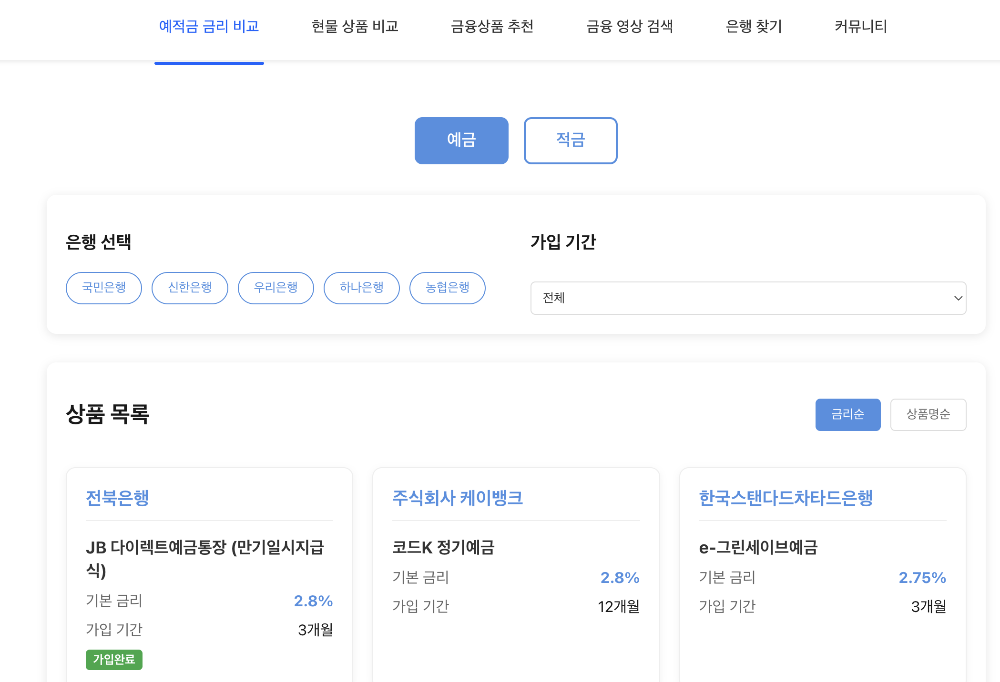
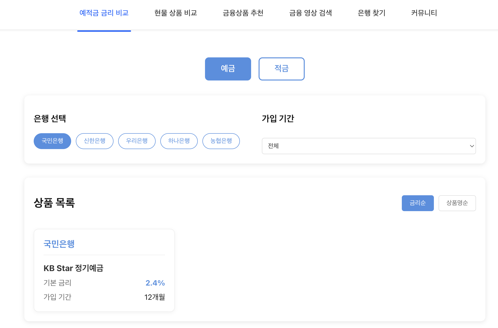
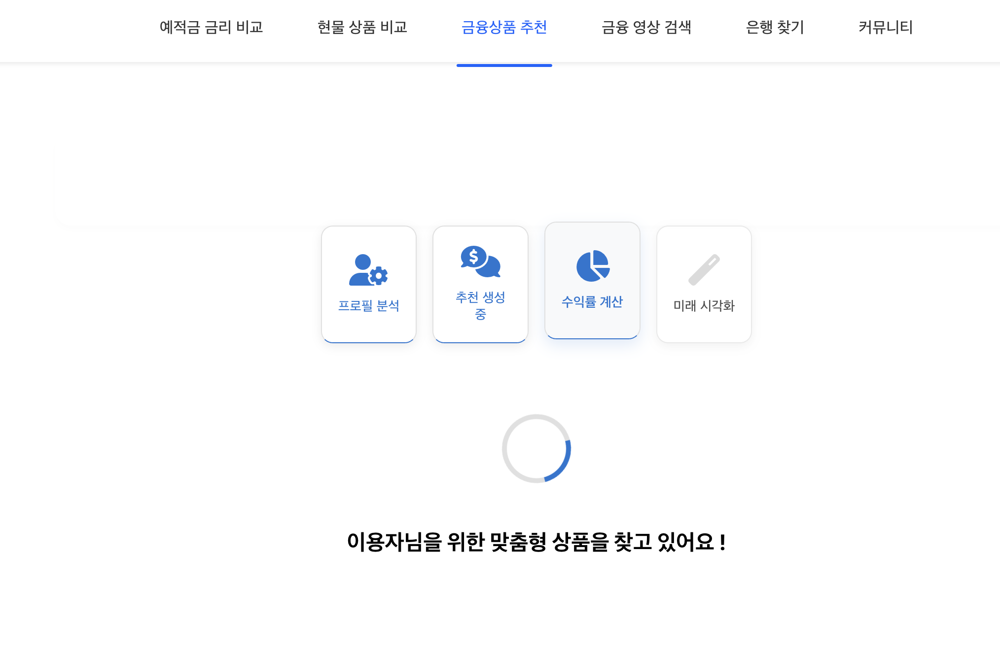
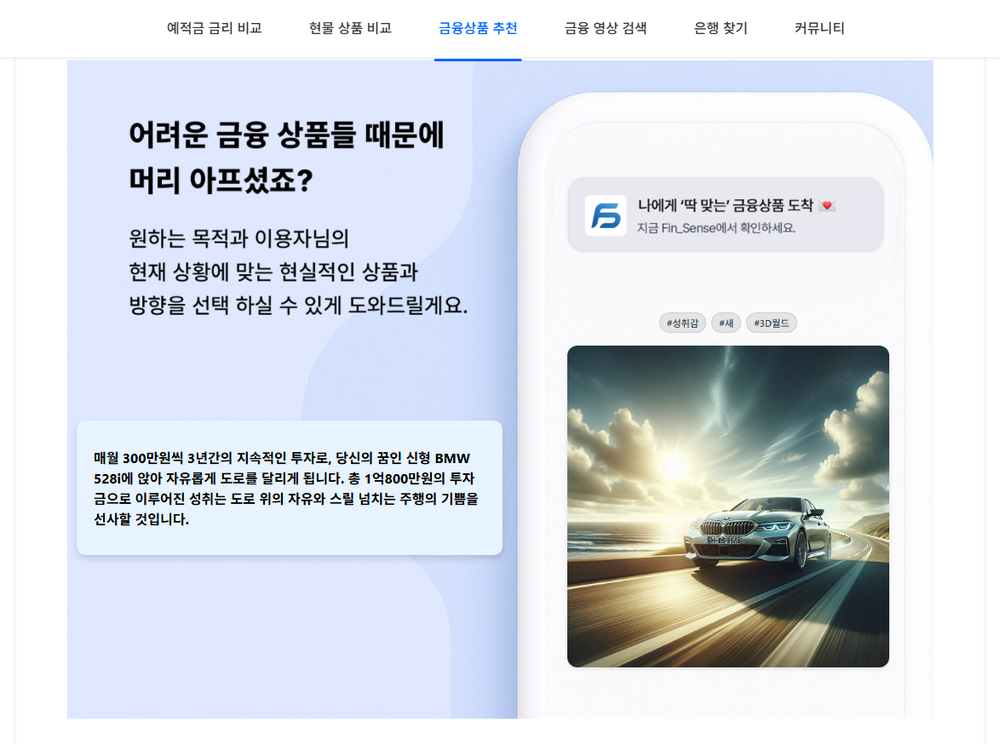
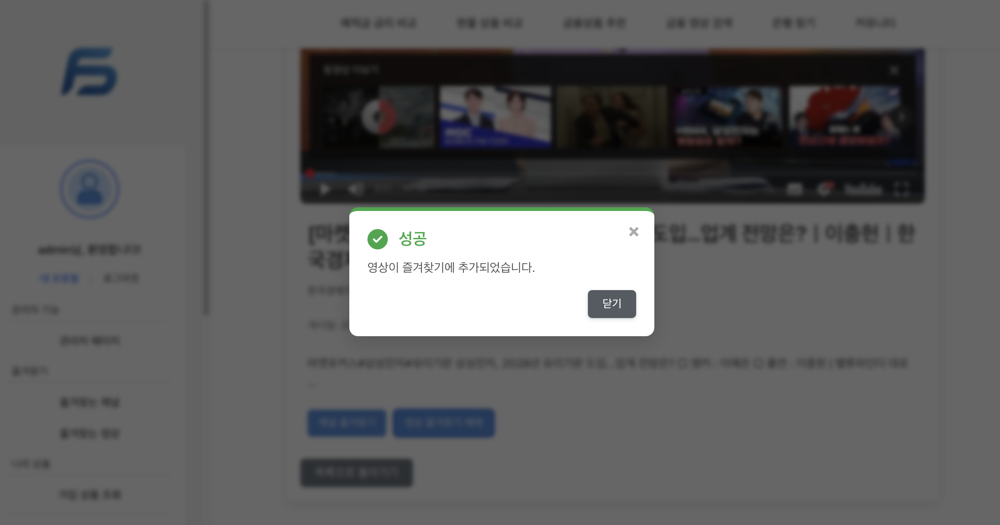
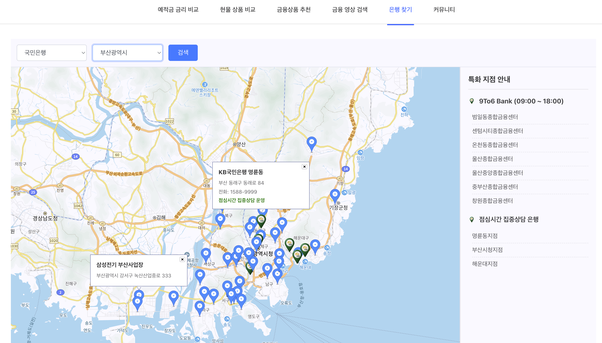
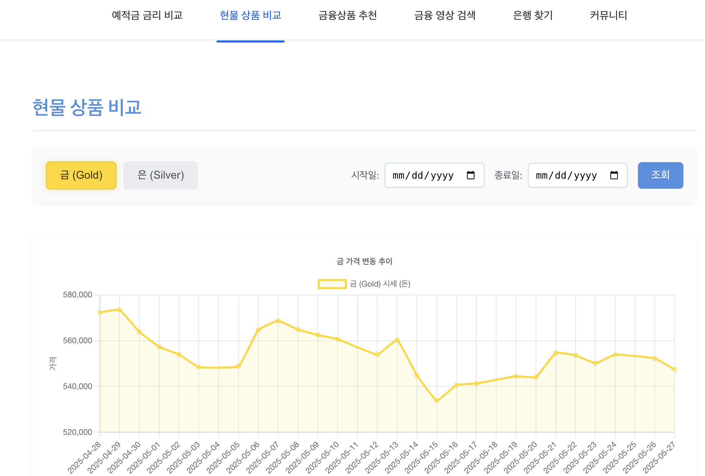
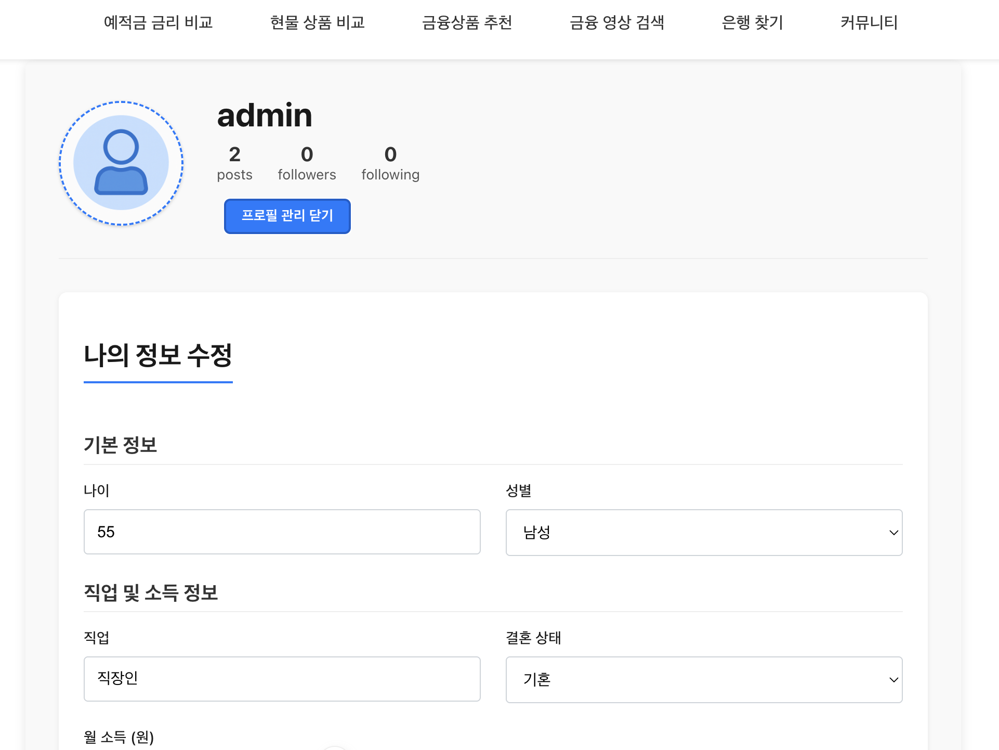
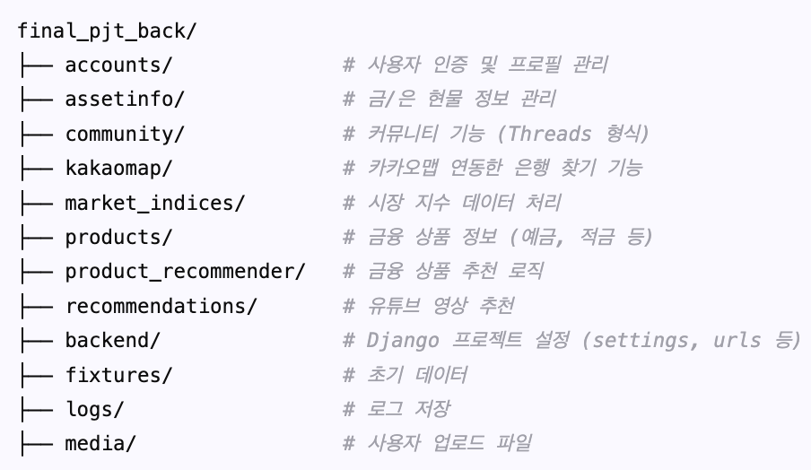

# final-pjt (금융)

# Fin_Sense
당신만을 위한 금융 인사이트, 지금 깨워보세요.

## 팀장 이석재, 팀원 임연지  

## 서비스 소개
 - 금융 정보와 실천을 한 번에 할 수 있도록 도와주는 서비스
 - 개발 기간 : 2025.05.22. - 2025.05.27.

## 서비스 특징
- 🤖 **AI 기반 금융 상품 추천**: 복잡한 챗봇 없이, 사용자의 활동 데이터에 기반하여 최적의 금융 상품 후보를 최대 3가지 추천해 드립니다.
- 📈 **실시간 증시 정보 제공**: 코스피 및 코스닥 지수를 크롤링하여 좌측 사이드바에 1시간 단위로 업데이트하여 제공합니다.
- 🥇 **현물 자산 실시간 시세**: DB 저장 가치가 아닌, 금/은과 같은 주요 현물 자산의 현재 시세를 확인할 수 있는 지표를 제공합니다.
- ▶️ **맞춤형 금융 동영상 큐레이션**: 인기 급상승 금융 관련 동영상 2개를 메인 화면에서 바로 접할 수 있으며, 유튜브 검색 시 금융 관련 영상이 우선 노출되어 원하는 정보를 쉽게 찾을 수 있습니다. (채널/영상 즐겨찾기 기능 포함)
- 🗺️ **주변 금융기관 상세 정보**: 카카오맵을 통해 주변 은행 위치를 안내할 뿐만 아니라, 각 은행 지점의 **특화 점포 정보(예: 18시까지 하는 점포, 점심시간 집중상담 점포 등)를 함께 제공함으로써 사용자에게 더욱 상세하고 유용한 정보를 전달합니다.
- 📧 **금융 상품 변동 즉시 알림**: 가입한 금융 상품의 금리 변동이나 중요한 정보 변경 시, 사용자에게 즉시 이메일로 알림을 전송하여 중요한 변경사항을 놓치지 않도록 합니다.

## 주요 기능
1. 📊 금융 상품 정보 및 비교
> 다양한 예금, 적금, 투자 상품 정보를 한눈에 확인하고, 조건별 비교를 통해 사용자에게 가장 적합한 금융 상품을 찾을 수 있도록 돕습니다.

  
  

2. 🤖 AI 기반 맞춤형 금융 추천
> 사용자의 활동 데이터와 금융 상품 정보를 기반으로 AI가 개인에게 최적화된 금융 상품 후보 최대 3가지를 추천합니다.

  
  
  

3. 👥 사용자 참여형 커뮤니티
> 금융, 투자, 경제 등 다양한 주제에 대해 자유롭게 의견을 나누고 정보를 공유할 수 있는 커뮤니티 공간입니다. 게시글 작성, 댓글, 좋아요, 팔로우 기능을 통해 사용자 간 활발한 소통을 지원합니다. 무한스크롤로 자연스럽게 로딩하여 사용자 몰입감 높였습니다.

  

4. 📰 금융 연관 동영상 콘텐츠
> YouTube API를 활용하여 관련 금융 및 경제 동영상 콘텐츠를 제공합니다. 캐싱 전략을 통해 빠르고 효율적으로 정보를 전달하고 한정된 API 할당량을 적절하게 사용하도록 하였습니다.

  
  
  

5. 🗺️ 주변 금융기관 찾기 (카카오맵 연동)
> 카카오맵 API를 연동하여 드롭다운으로 선택한 은행과 지역에 따른 은행들의 위치를 제공하고, 은행의 특화점포 정보와 길찾기 등의 편의 기능을 지원합니다.

  
  
  

6. 현물 상품 가격 변동 확인

  

7. 👤 사용자 인증 및 프로필 관리
> 안전한 회원가입 및 로그인 기능을 제공하며, 사용자는 자신의 프로필 정보 관리, 관심 상품 저장, 팔로우/팔로워 관리 등을 할 수 있습니다.

  
  
  
  

## 🛠️ 기술 스택

#### 프론트엔드
- Vue.js: 반응형 UI 구축을 위한 프로그레시브 JavaScript 프레임워크
- Pinia: Vue.js 상태 관리 라이브러리
- Axios: HTTP 통신 라이브러리
- Vite: 빠르고 효율적인 프론트엔드 빌드 도구
- HTML5, CSS3, JavaScript (ES6+)

#### 백엔드
- Django: Python 기반의 고수준 웹 프레임워크
- Django REST Framework (DRF): 강력하고 유연한 API 개발 도구
- Python: 백엔드 주 개발 언어

#### 데이터베이스
- SQLite: 개발 단계에서의 기본 데이터베이스

#### 외부 API
- YouTube Data API v3: 경제 뉴스 관련 동영상 검색 및 제공
- Kakao Maps API: 위치 기반 서비스 제공

#### 기타
- Git & GitHub: 버전 관리 및 협업

## 개발 환경
Django 4.2.4  

Vue 3.5.14

## 디렉토리 구조

  
  

## ERD

  

## 문서
[Fin_Sense 프로젝트 상세 문서 (Notion)](https://www.notion.so/Fin_Sense-1ed0229ee907805ea93ecfd86a9dd8d9?pvs=4)